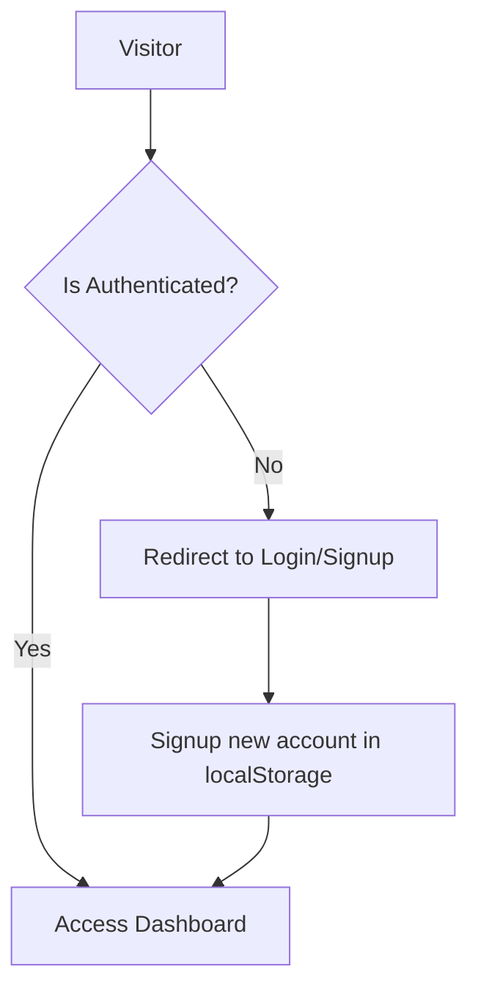

# ZenFlow 🧘✨

Bring clarity, order, and calm to your workday. ZenFlow is a sleek, modern personal workspace and dashboard application designed for professionals to organize tasks, manage reminders, track monthly expenses, and monitor weekly productivity trends in a clean, distraction-free interface.

---

## Table of Contents

- [Core Principles & Design Philosophy](#core-principles--design-philosophy)
- [Key Features](#key-features)
- [Architecture & Tech Stack](#architecture--tech-stack)
- [Detailed Component Guide](#detailed-component-guide)
  - [Sidebar Navigation](#sidebar-navigation)
  - [Tasks Widget](#tasks-widget)
  - [Productivity Graph](#productivity-graph)
  - [Reminders List](#reminders-list)
  - [Expenses Tracker](#expenses-tracker)
- [Authentication System & Route Protection](#authentication-system--route-protection)
- [Getting Started](#getting-started)
  - [Prerequisites](#prerequisites)
  - [Installation](#installation)
  - [Running the Application](#running-the-application)
- [Future Roadmap](#future-roadmap)

---

## Core Principles & Design Philosophy

ZenFlow was built on the foundation of **cognitive-load reduction**. Modern professional dashboards are often crowded with notifications, alerts, complex menus, and overwhelming visual noise. ZenFlow takes the opposite approach by using:
1. **Curated Color Palettes**: Clean typography paired with soft borders (`border-slate-100/80`) and subtle contrasts that reduce eye strain.
2. **Horizontal and Vertical Alignment**: Every widget is laid out using a strict 2x2 grid spacing (`gap-6`) that automatically scales to the user's screen.
3. **Painless Interactions**: Quick toggles, smooth transition animations, and a cohesive design language that ensures ease of use.

---

## Key Features

- 🖥️ **Full-Screen Workspace**: Maximized viewport utilization (`w-screen h-screen`) for an immersive dashboard experience.
- ⚙️ **Unified Sidebar**: Combines window controls (macOS styling), search tools (`Search ZenFlow...`), and main navigation in a single, left-aligned column.
- 📋 **Integrated Tasks Card**: Real-time checklists with category badge tags and completion line-through styling.
- 📈 **SVG Curved Line Chart**: Custom-drawn line graphs using vector maths to depict weekly output metrics with light blue gradient highlights.
- 🔔 **Bell Reminders list**: A clean schedule widget highlighting times and labels using unified color indicators.
- 💳 **Segmented Progress Bar**: Visualizes budget allocations (Software, Travel, Other) in a sleek horizontal percentage bar.
- 🔐 **Route-Guarded Authentication**: Automatically verifies user status and redirects unauthorized traffic back to the login screen.

---

## Architecture & Tech Stack

ZenFlow utilizes a modern frontend stack designed for speed, flexibility, and maintainability:

* **Framework**: [Next.js](https://nextjs.org/) (App Router structure using React 19)
* **Styling**: [Tailwind CSS v4](https://tailwindcss.com/) (using base utility layers and native theme variables)
* **Icons**: [Lucide React](https://lucide.dev/) (consistent geometric outlines)
* **State Management**: React Context Provider for global authentication tracking

---

## Detailed Component Guide

### Sidebar Navigation
Located in `frontend/src/components/dashboard/sidebar.tsx`, the sidebar acts as the central control area:
- **macOS Window Controls**: Styled indicators mimicking close, minimize, and zoom controls.
- **Search Bar**: Quick-filter input with responsive hover/focus border rings.
- **Logo & Title**: Simple clean icon and title tracking.
- **Menu Options**: Navigation items (Overview, Tasks, Calendar, Expenses, Insights, Settings) with active state rendering (`bg-[#E2EEFC] text-[#1D70E8]`).

### Tasks Widget
Located in `frontend/src/components/dashboard/cards/tasks-card.tsx`:
- List items are rendered without boxing backgrounds to maximize space.
- Includes a toggle handler that shifts completion status, adding strike-through formatting and changing unchecked icons into check icons.
- Category tags use an elegant, universal light-gray style (`bg-[#F1F3F5] text-slate-500`) to prevent visual overload.

### Productivity Graph
Located in `frontend/src/components/dashboard/cards/productivity-card.tsx`:
- Uses an inline SVG element (`viewBox="0 0 320 120"`) to build an animated curved path.
- Smooth cubic bezier command syntax (`C`) handles point connections.
- Bottom coordinates map cleanly to the horizontal labels `M T W T F S S`.

### Reminders List
Located in `frontend/src/components/dashboard/cards/reminders-card.tsx`:
- A simple, structured feed of tasks displaying descriptions and precise completion times.
- Anchored with blue notification points (`bg-[#1D70E8]`) that align text blocks vertically.

### Expenses Tracker
Located in `frontend/src/components/dashboard/cards/expenses-card.tsx`:
- Segmented bar chart rendering values relative to overall percentages.
- Layout places currency amounts directly below the title header.
- Categories Software, Travel, and Other are rendered as custom bullet points in a single horizontal footer line.

---

## Authentication System & Route Protection

ZenFlow uses a client-side authentication provider built on React Context.



1. **AuthProvider Context** (`lib/auth.tsx`): Wraps the entire layout to manage current authentication state.
2. **Mount Hook**: On mount, checks client `localStorage` for keys `isAuthenticated` and `user`.
3. **Route Guard**: The dashboard page checks `isAuthenticated`. If false, Next.js programmatically redirects the user to `/login`.

---

## Getting Started

### Prerequisites

Ensure you have **Node.js** (v18.0.0 or higher) and **npm** installed.

### Installation

1. Clone the repository and navigate to the project directory:
   ```bash
   git clone https://github.com/NavidZamanKhan/ZenFlow.git
   cd ZenFlow
   ```

2. Move into the frontend workspace:
   ```bash
   cd frontend
   ```

3. Install project dependencies:
   ```bash
   npm install
   ```

### Running the Application

1. Launch the development server:
   ```bash
   npm run dev
   ```

2. Open your browser and navigate to:
   * **Dashboard Workspace**: [http://localhost:3000/dashboard](http://localhost:3000/dashboard) (protected route)
   * **User Registration**: [http://localhost:3000/register](http://localhost:3000/register)

3. Log in or register. The credentials will save locally in your browser storage.

---

## Future Roadmap

- [ ] **Database Integration**: Migrate authentication from client-side `localStorage` to a server database (e.g., PostgreSQL).
- [ ] **State Syncing**: Connect task, reminder, and expense logs to an API to allow cross-device updates.
- [ ] **Interactive Calendar Widget**: Expand the static reminders list into a fully interactive weekly calendar.
- [ ] **Expense Categories editor**: Allow custom budget definitions, color assignments, and tags.
