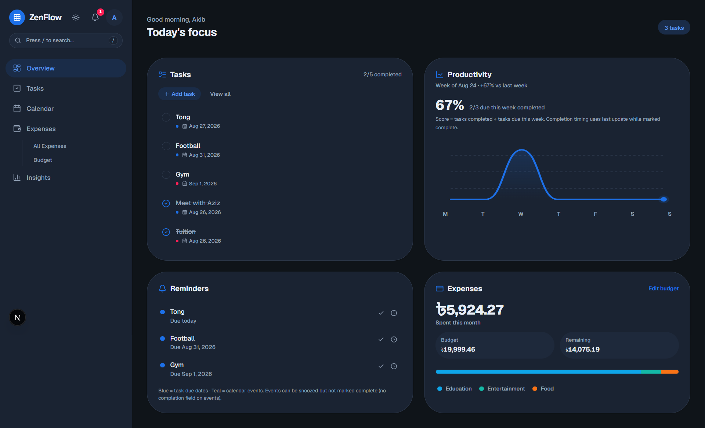
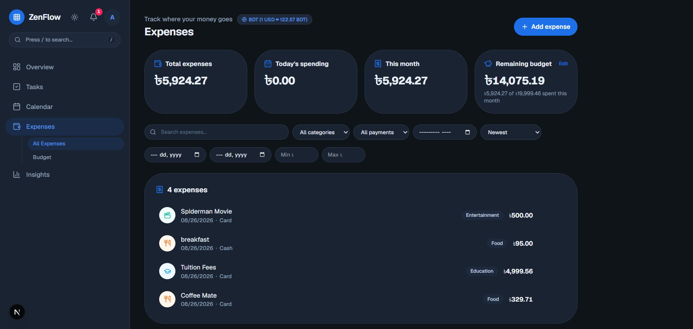
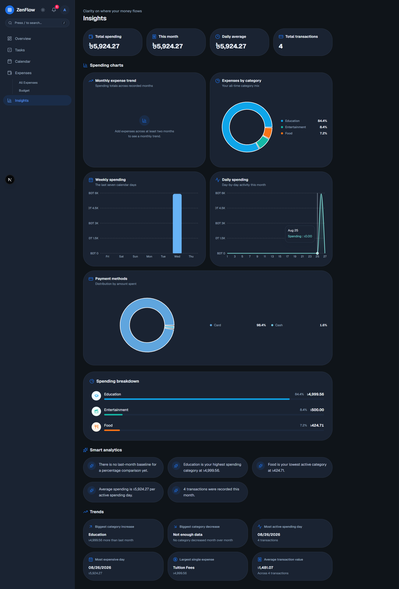

# ZenFlow

A calm productivity and expense workspace for organizing tasks, calendar events, reminders, spending, budgets, and insights in one place.


---

## Overview

ZenFlow is a decoupled web application with a **Next.js** frontend and a **Django REST Framework** backend. The product focuses on a quiet, minimal interface: an Overview dashboard for “today’s focus,” full task and calendar management, multi-currency expenses and budgets, and client-side Insights charts.

---

## Screenshots

### Landing


### Dashboard (Overview)



### Expenses



### Insights



---

## Features

### Implemented

| Area | What you get |
|------|----------------|
| **Landing** | Marketing page with Features, About, Contact (mailto), and auth CTAs |
| **Authentication** | Email/password signup with OTP verification, login, Google OAuth, logout, password reset OTP, account deletion OTP |
| **Overview** | Personalized greeting, tasks snapshot, weekly productivity chart, reminders (task dues + calendar events), expenses & budget summary |
| **Tasks** | Create/update/complete tasks with priorities, categories, due dates, filters, and sorting |
| **Calendar** | Day / week / month views via FullCalendar; create and drag-reschedule events |
| **Expenses** | Log expenses with category & payment method, search/filter/sort, multi-currency display (e.g. BDT) |
| **Budget** | Monthly budget with remaining balance and spending progress |
| **Insights** | Spending totals, category/payment donuts, weekly & daily charts, trend cards and smart summary tags |
| **Search** | Global search (`/` / spotlight) across tasks, expenses, events, and settings destinations |
| **Notifications** | In-app notification bell in the dashboard chrome |
| **Settings** | Appearance (accent colors, density), expense preferences (display currency), security (password / account) |
| **Profile** | User profile view from the account menu |
| **Theming** | Light UI with selectable brand accents (blue, teal, violet, coral); dark-mode chrome exists in the shell |

### Planned / future improvements

- Silent JWT access-token refresh (refresh tokens are stored; refresh endpoint wiring is still TODO)
- Dedicated backend routes under `/api/reminders/` and `/api/analytics/` (stubs today; reminders/insights are driven from tasks, events, and expenses on the client)
- Full dark / system theme persistence (appearance UI currently emphasizes light)
- Broader a11y contrast polish for some accent palettes

---

## Tech stack

### Frontend (`frontend/`)

- **Next.js 16** (App Router) · **React 19** · **TypeScript**
- **Tailwind CSS v4** · **shadcn/ui** (Base UI) · **Lucide** icons
- **Framer Motion** · **FullCalendar** · **Recharts**
- **React Hook Form** + **Zod** · **next-themes** · **Sonner**
- **@react-oauth/google** for Google sign-in

### Backend (`backend/`)

- **Django 6** · **Django REST Framework**
- **PostgreSQL** (via **psycopg**)
- **SimpleJWT** (access + refresh) · **Argon2** password hashing
- **django-cors-headers** · Google ID token verification
- **gunicorn** · **whitenoise** · **dj-database-url** (deploy-friendly DB config)

### Architecture

```text
frontend/ (Next.js)  ←→  REST + JWT  ←→  backend/ (Django DRF + PostgreSQL)
```

Backend flow: **Views → Serializers → Services → Models**.  
Frontend: **Auth context** for session hydration; **custom hooks** (`use-tasks`, `use-expenses`, `use-budget`, `use-events`, …) for domain data.

---

## Project structure

```text
ZenFlow/
├── Screenshots/          # README product screenshots
├── frontend/             # Next.js app
│   └── src/
│       ├── app/          # Routes (landing, login, register, dashboard/*)
│       ├── components/   # UI, landing, dashboard, auth
│       ├── hooks/        # Data & UI hooks
│       ├── lib/          # API client, auth, currency, accents, search
│       └── types/        # Shared TypeScript types
├── backend/              # Django project
│   ├── config/           # Settings & root URLs
│   ├── users/            # Auth, profile, OTP, Google
│   ├── tasks/            # Task API
│   ├── events/           # Calendar events API
│   ├── expenses/         # Expense API
│   ├── budget/           # Budget API
│   ├── reminders/        # URL stub (future)
│   └── analytics/        # URL stub (future)
├── netlify.toml          # Frontend deploy (Netlify + Next.js plugin)
└── README.md
```

### Main app routes

| Path | Purpose |
|------|---------|
| `/` | Landing |
| `/login`, `/register` | Auth |
| `/dashboard` | Overview |
| `/dashboard/tasks` | Tasks |
| `/dashboard/calendar` | Calendar |
| `/dashboard/expenses` | All expenses |
| `/dashboard/expenses/budget` | Budget |
| `/dashboard/insights` | Insights |
| `/dashboard/settings` | Settings |
| `/dashboard/profile` | Profile |

---

## Getting started

### Requirements

- **Node.js** 18+
- **Python** 3.12+
- **PostgreSQL** 14+ (17 recommended)

### 1. Clone

```bash
git clone https://github.com/NavidZamanKhan/ZenFlow.git
cd ZenFlow
```

### 2. Backend

```bash
cd backend
python -m venv .venv

# Windows
.venv\Scripts\activate

# macOS / Linux
# source .venv/bin/activate

pip install -r requirements.txt
```

Copy `backend/.env.example` to `backend/.env` and set your PostgreSQL credentials (and optional email / Google client ID).

```bash
python manage.py migrate
python manage.py runserver
```

API defaults to [http://localhost:8000](http://localhost:8000).

### 3. Frontend

```bash
cd frontend
npm install
```

Copy `frontend/.env.example` to `frontend/.env.local` if you use Google OAuth (`NEXT_PUBLIC_GOOGLE_CLIENT_ID`). Point the API base URL at your backend (see your frontend env / deploy config for `NEXT_PUBLIC_API_URL` when used).

```bash
npm run dev
```

App defaults to [http://localhost:3000](http://localhost:3000).

### 4. Useful commands

```bash
# Frontend
cd frontend && npm run build && npm run lint

# Backend (with venv active)
cd backend && python manage.py migrate && python manage.py test
```

---

## API surface (high level)

Authenticated routes expect `Authorization: Bearer <access_token>`.

| Prefix | Role |
|--------|------|
| `/api/auth/` | Register, OTP verify/resend, login, Google, logout, me, password & delete-account flows |
| `/api/tasks/` | Task CRUD |
| `/api/events/` | Calendar event CRUD |
| `/api/expenses/` | Expense CRUD |
| `/api/budget/` | Budget read/update & related helpers |
| `/api/reminders/` | Reserved (no routes yet) |
| `/api/analytics/` | Reserved (no routes yet) |

---

## Deployment notes

- **Frontend:** Netlify via `netlify.toml` (`@netlify/plugin-nextjs`).
- **Backend:** Designed for a host that can run Django + PostgreSQL (e.g. Render/Neon-style `DATABASE_URL` through `dj-database-url`).

---

## Team

Built by [NavidZamanKhan](https://github.com/NavidZamanKhan) and [ak1bhasan](https://github.com/ak1bhasan).

---

## License

No `LICENSE` file is currently published in the repository. Add one if you intend to distribute ZenFlow under a specific open-source license.
